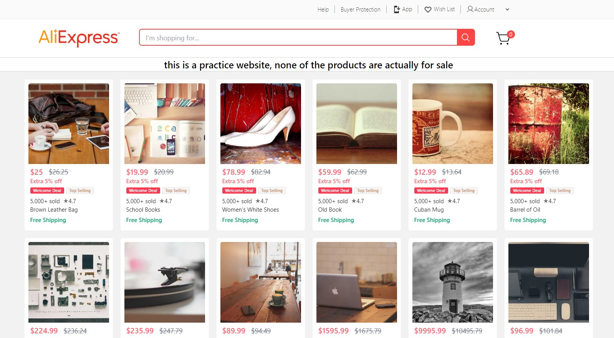
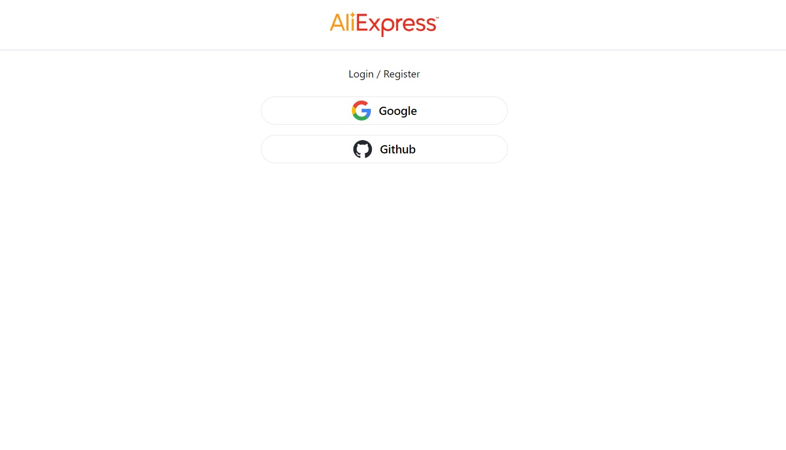
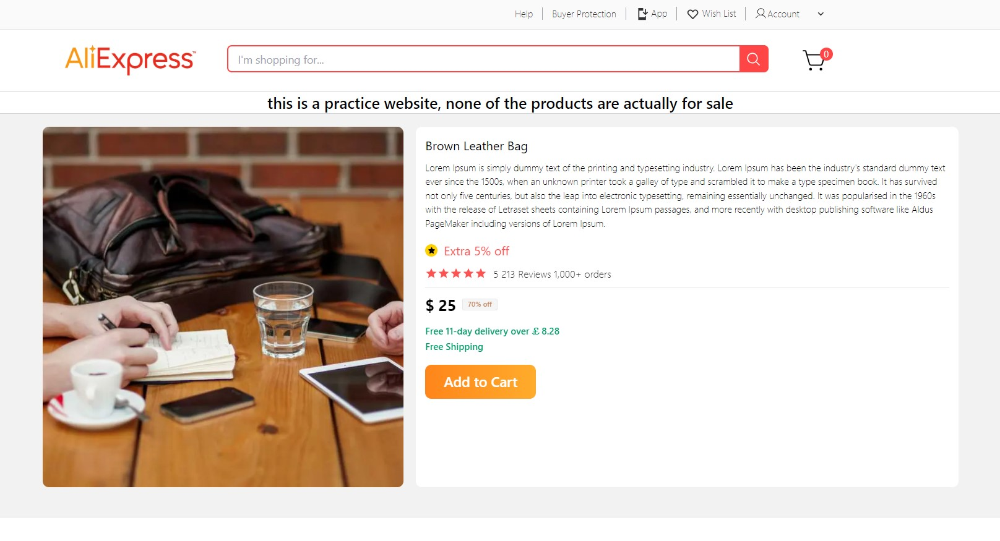
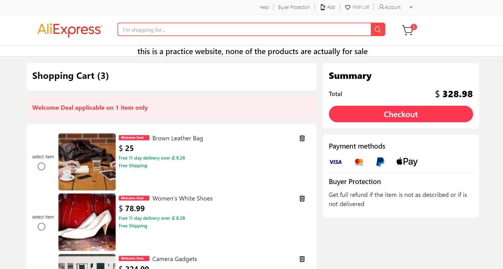
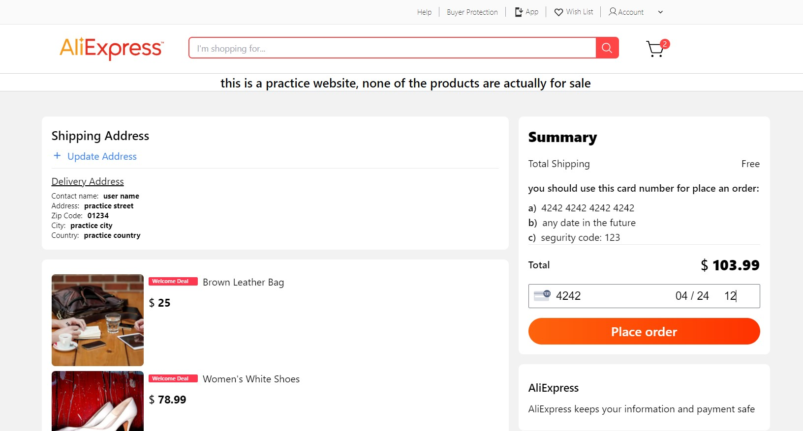
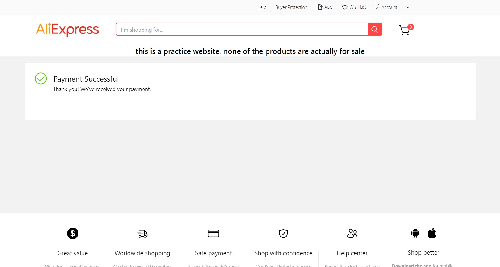
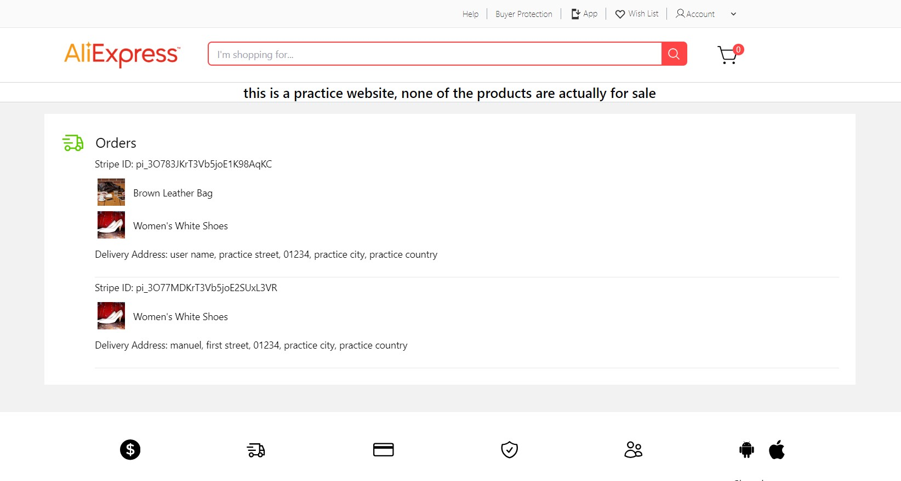

# AliExpress Web Clone / Web Practice 

---

### Hi! Welcome to this new project. This is a web practice made with:

- Nuxt 3

- Tailwindcss

- Prisma

- Stripe

- Supabase

---

### Some of the functionalities of the application are:

- Login and logout

- Select a product

- Add to cart a product

- Delete a product from cart

- Add and update Shipping address

- Buy a product ( using a test card number, you can simulate a purchase ).

- See your Orders

---

## Application Images

#### Home View:

---

#### Home View:

---

#### Product View:

---

#### Shopping View:

---

#### Checkout View:

---

#### Success View:

---

#### Orders View:
